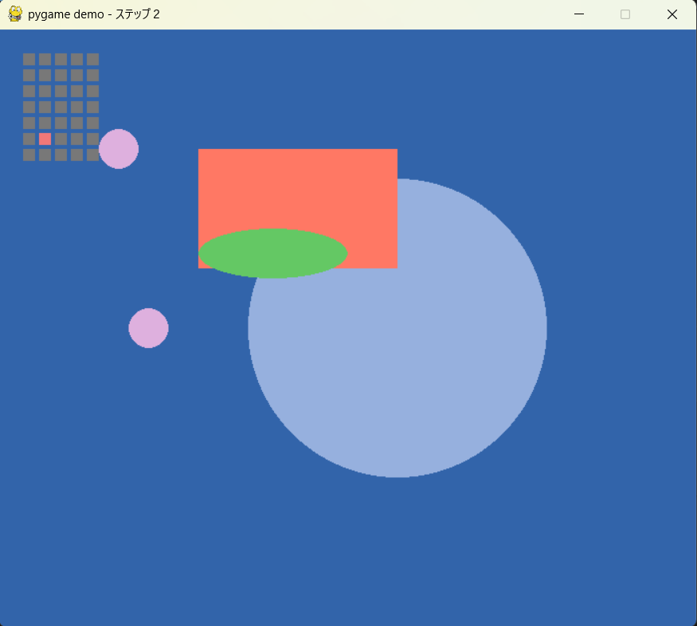

# pygame_samples

 - demo_01.py: pygameの超簡単なデモ。
 - demo_02.py: 7セグのシミュレーション、各セグメントを2ブロックで構成。Seven_segクラス使用。
 - demo_LCD_font_01.py: 5x7のLCDフォント制作用。LCD_fontクラス使用。
 - demo_LCD_font.py: 5x7のLCDフォント、完成版。

 - demo_freetype.py: pygame.freetypeでテキスト表示。（新しい方式）
 - demo_freetype.py: pygame.fontでテキスト表示。（古い方式）
 - demo_openmoji.py: オープンソースの絵文字、openmojiのデモ。キー操作のデモ。
 - seven_seg_pg.py: Seven_segクラス
 - lcd_font_pg.py: LCD_fontクラス

demo_01

ウィンドウの大きさ
[]のなかの数字を変えると大きさを変えれる
screen = pygame.display.set_mode([700, 600])

タイトルバー
"のなかを変えるとタイトルバーの文字を変えれる
pygame.display.set_caption("pygame demo - ステップ２")

背景色
()のなかの３つの数字を変えると背景色をかえれる
screen.fill((50, 100, 170))

円の色、位置、大きさ、
左の()のなかが色、真ん中の二つの数が位置、右の数が大きさ
pygame.draw.circle(screen, (150 , 176, 222), (400, 300), 150)

他の図形
circleのところを変えればほかの図形になる
pygame.draw.rect(screen, (255, 120, 100), Rect(200, 120, 200, 120))

xを１増やす（赤いドットを右に移動させる）
 x1 += 1

赤いドットが右端についたらｘを０にして左端に戻す
 if x1 > 4:
        x1 = 0

x1 = 0の下につけてるから、ｘが０になったらｙを１増やす（赤いドットを下に移動させる）
        y1 += 1
        
赤いドットが一番下の右端についたら上に戻す
        if y1 > 6:
         y1 = 0

３～９のlcdフォント

LCD_3 = (1, 1, 1, 1, 0,
         0, 0, 0, 0, 1,
         0, 0, 0, 0, 1,
         1, 1, 1, 1, 0,
         0, 0, 0, 0, 1,
         0, 0, 0, 0, 1,
         1, 1, 1, 1, 0)

LCD_4 = (1, 0, 0, 0, 1,
         1, 0, 0, 0, 1,
         1, 0, 0, 0, 1,
         0, 1, 1, 1, 1,
         0, 0, 0, 0, 1,
         0, 0, 0, 0, 1,
         0, 0, 0, 0, 1)

LCD_5 = (0, 1, 1, 1, 1,
         1, 0, 0, 0, 0,
         1, 0, 0, 0, 0,
         0, 1, 1, 1, 0,
         0, 0, 0, 0, 1,
         0, 0, 0, 0, 1,
         1, 1, 1, 1, 0)

LCD_6 = (0, 1, 1, 1, 0,
         1, 0, 0, 0, 0,
         1, 0, 0, 0, 0,
         1, 1, 1, 1, 0,
         1, 0, 0, 0, 1,
         1, 0, 0, 0, 1,
         0, 1, 1, 1, 0)

LCD_7 = (0, 1, 1, 1, 0,
         1, 0, 0, 0, 1,
         1, 0, 0, 0, 1,
         1, 0, 0, 0, 1,
         0, 0, 0, 0, 1,
         0, 0, 0, 0, 1,
         0, 0, 0, 0, 1)

LCD_8 = (0, 1, 1, 1, 0,
         1, 0, 0, 0, 1,
         1, 0, 0, 0, 1,
         0, 1, 1, 1, 0,
         1, 0, 0, 0, 1,
         1, 0, 0, 0, 1,
         0, 1, 1, 1, 0)

LCD_9 = (0, 1, 1, 1, 0,
         1, 0, 0, 0, 1,
         1, 0, 0, 0, 1,
         0, 1, 1, 1, 1,
         0, 0, 0, 0, 1,
         0, 0, 0, 0, 1,
         0, 1, 1, 1, 0)

ここにLCD3~9を追加する
       LCD_font_styles = (LCD_0, LCD_1, LCD_2, LCD_3, LCD_4, LCD_5, LCD_6, LCD_7, LCD_8, LCD_9)  

一の位と十の位
    lcd1.update_col(col=0, code=code1)
    lcd1.update_col(col=1, code=code)

:と-のフォント
LCD_10 = (0, 0, 0, 0, 0,
         0, 1, 1, 0, 0,
         0, 1, 1, 0, 0,
         0, 0, 0, 0, 0,
         0, 1, 1, 0, 0,
         0, 1, 1, 0, 0,
         0, 0, 0, 0, 0)

LCD_11 = (0, 0, 0, 0, 0,
         0, 0, 0, 0, 0,
         0, 0, 0, 0, 0,
         1, 1, 1, 1, 1,
         0, 0, 0, 0, 0,
         0, 0, 0, 0, 0,
         0, 0, 0, 0, 0)

時間
lcd1.update_col(col=0, code=dt_now.hour // 10)
lcd1.update_col(col=1, code=dt_now.hour % 10)
：
lcd1.update_col(col=2, code=10)
分
lcd1.update_col(col=3, code=dt_now.minute // 10)
lcd1.update_col(col=4, code=dt_now.minute % 10)
：
lcd1.update_col(col=5, code=10)
秒
lcd1.update_col(col=6, code=dt_now.second // 10)
lcd1.update_col(col=7, code=dt_now.second % 10)

